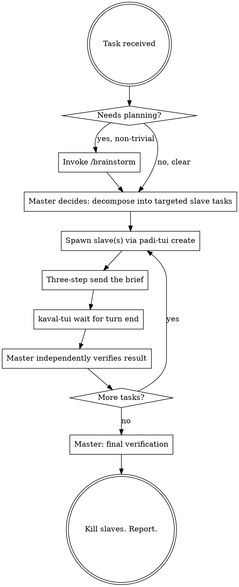

# Execute — master-agent orchestration over kolu terminals

The agent on which `/execute` is invoked is the **master**. The master is the only intelligence in this workflow: it understands the task, makes every decision, and is accountable for the outcome. Slave terminals (OpenCode instances running in kolu) are execution instruments — hands, not judgment. A slave does exactly the narrow, targeted piece of work it is briefed on and reports back; it never decides what to do next, and the master never assumes it did so correctly without checking.

Concretely, the master:
- **Thinks and plans.** All design decisions, task decomposition, and sequencing happen in the master's head, not a slave's.
- **Delegates narrowly.** Each slave gets one targeted, self-contained unit of work with a clear boundary — never "go improve X," always "do this specific thing, in this specific place, to this specific standard."
- **Never executes directly.** The master doesn't open files to edit them, doesn't run builds, doesn't do research by hand — that's what slaves are for.
- **Verifies independently.** A slave's own report of success is a claim, not proof. The master confirms it through evidence it can inspect itself — command output, diffs, test results — before treating a task as done.

## Tooling map

- Spawn a slave: `padi-tui create -- <cmd>` (or `kaval-tui create -- <cmd>` for a raw PTY; both appear on the kolu canvas). Add `--worktree <branch>` to isolate the work in a fresh git worktree.
- See what's on a slave's screen: `kaval-tui snapshot <id> --viewport` (or `--tail N` for last N lines).
- Send a prompt to a slave: the canonical **three-step send** —
  1. `kaval-tui send <id> "the prompt"` (the text only — never an implicit Enter)
  2. `kaval-tui wait <id> --until idle:300` (let the TUI settle)
  3. `kaval-tui send <id> --key Enter` (submit)
- Block until a slave's turn ends: `kaval-tui wait <id> --until idle:1500 --timeout 600000` (raw-PTY done-signal, works for any terminal). For padi-owned terminals, `padi-tui wait <id> --until awaiting,waiting` is the equivalent.
- Kill a slave when done: `kaval-tui kill <id>`.

**Large briefs:** `kaval-tui send` folds big pastes unreliably (issue #1702). For anything more than a few lines, write the brief to a file (master may use `Write` for this one purpose) and send the slave a short prompt: `read <path> and follow it`.

## Workflow

### 1. Think and decide (master only)

- If the task needs genuine design thinking, invoke the **`/brainstorm`** skill first to pressure-test the plan. The master owns every judgment call in that process — nothing here is delegated.
- If the task is already an approved plan, invoke the **`/develop`** skill's conventions — but the master's role stays orchestration: it reads the plan and breaks it into slave-sized chunks itself.
- Otherwise decompose the task directly. Use `todowrite` to keep the decomposition visible and track which chunks are dispatched, running, and verified.

The output of this step is always a set of **targeted** work orders — each one small enough that a slave can execute it without having to make a judgment call the master didn't already make for it.

### 2. Write the slave brief (master writes, slave has no context)

A slave starts with zero knowledge of this conversation. Every brief must be self-contained and narrow:
- The exact goal and acceptance criteria for this chunk — and nothing beyond it.
- File paths / symbols in scope; what is explicitly OUT of scope (slaves left to guess scope will wander).
- The verification command the slave itself should run before reporting (`cargo build`, `npm test`, etc.) — this is a first check, not a substitute for the master's own verification in step 4.
- A completion marker to print at the end, e.g. `DONE: <short summary>` or `BLOCKED: <reason>`, so the master can `wait --until match:` or snapshot for it.

If a brief can't be written this precisely, the decomposition in step 1 was too coarse — tighten it before dispatching.

### 3. Dispatch and wait

- Slave OpenCode command: `padi-tui create -- opencode` (or with `--worktree feat-x` for isolation).
- Parallel independent tasks → one slave each. Dependent tasks → sequential on one slave, so later steps see the state earlier ones produced.
- Never send a second prompt until `kaval-tui wait` confirms the previous turn ended (or a snapshot shows the agent idle at a prompt). Overlapping sends corrupt the slave's input.

### 4. Verify independently (master only, after every slave turn)

Treat "done" from a slave as an unverified claim until the master has checked it by its own means. In order of preference:
1. Ask the slave for evidence (`paste the test output`) and inspect it via `snapshot` — read the actual output, don't take the slave's summary of it.
2. Spawn a dedicated verification slave — separate from the one that did the work — to run the build/tests and report the exit code. A fresh slave has no incentive to rationalize the first slave's work as correct.
3. Master's own `Bash` — allowed ONLY for read-only inspection (`git diff --stat`, `git status`, reading a test log). The master never edits files by hand, even to "just fix this one thing."

If verification fails, that's a decision point, not a retry button: diagnose why from the evidence, then send a corrective brief back to the same slave with the exact failure output and what to change.

### 5. Close out

Once every chunk is dispatched and independently verified, do one final pass across the whole change (not just the last chunk) before reporting completion to the user, then kill all slaves.

## Red flags — STOP

- Master editing source files with `Edit`/`Write` instead of delegating to a slave. (Brief files for slaves are the single allowed exception.)
- A brief that says "improve," "handle," or "look into" instead of naming the exact change and its boundary — that's the master offloading a decision it should have made itself.
- Sending prompt text and Enter in the same breath — the TUI's paste debounce drops it. Always the three-step send.
- Marking a task done because a slave said `DONE` — verify before trusting.
- Sending a huge paste; use a brief file + `read <path>` instead.
- Not killing slaves at the end.

## Quick reference

| Want | Command |
|------|---------|
| List live terminals | `kaval-tui list` / `padi-tui status` |
| New slave (plain) | `padi-tui create -- opencode` |
| New slave (isolated) | `padi-tui create --worktree my-branch -- opencode` |
| Send a prompt | `kaval-tui send <id> "..."` then `wait --until idle:300` then `send <id> --key Enter` |
| Wait for slave turn end | `kaval-tui wait <id> --until idle:1500 --timeout 600000` |
| Read slave screen | `kaval-tui snapshot <id> --viewport` |
| Read slave scrollback | `kaval-tui snapshot <id> --tail 100` or `kaval-tui history <id> --lines 100` |
| Remote host | add `--host <ssh>` to either CLI |
| Clean up | `kaval-tui kill <id>` |
