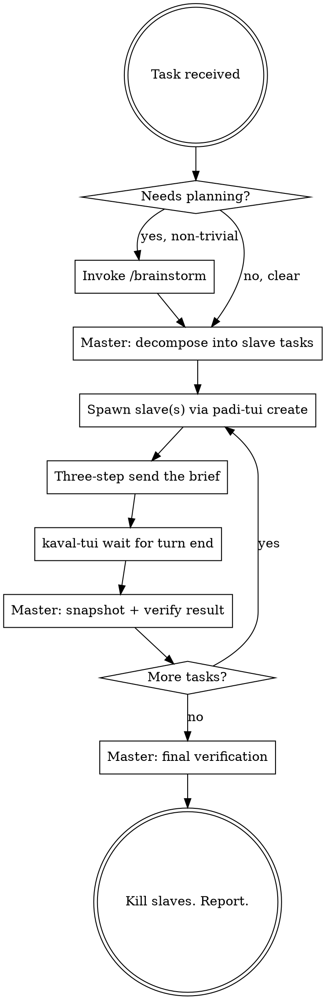

# Execute — master-agent orchestration over kolu terminals

The agent on which `/execute` is invoked is the **master**. The master does ALL thinking, planning, decision-making, and verification. Slave terminals (OpenCode instances running in kolu) do ALL typing: implementation, code search, file reads/writes, running build/test commands, and reporting back.

The master never opens files to edit them, never runs builds, and never does research directly — those go to slaves. The master only runs orchestration commands (`kaval-tui`, `padi-tui`), reads slave snapshots, and verifies slave output.

## Tooling map

- Spawn a slave: `padi-tui create -- <cmd>` (or `kaval-tui create -- <cmd>` for a raw PTY; both appear on the kolu canvas). Add `--worktree <branch>` to isolate the work in a fresh git worktree.
- See what's on a slave's screen: `kaval-tui snapshot <id> --viewport` (or `--tail N` for last N lines).
- Send a prompt to a slave: the canonical **three-step send** —
  1. `kaval-tui send <id> "the prompt"` (the text only — never an implicit Enter)
  2. `kaval-tui wait <id> --until idle:300` (let the TUI settle)
  3. `kaval-tui send <id> --key Enter` (submit)
- Block until a slave's turn ends: `kaval-tui wait <id> --until idle:1500 --timeout 600000` (raw-PTY done-signal, works for any terminal). For padi-owned terminals, `padi-tui wait <id> --until awaiting,waiting` is the equivalent.
- Kill a slave when done: `kaval-tui kill <id>`.

**Large briefs:** `kaval-tui send` folds big pastes unreliably (issue #1702). For anything more than a few lines, write the brief to a file (master may use `Write` for this one purpose) and send the slave a short prompt: `read <path> and follow it`.

## Workflow

### 1. Plan (master only)

- If the task needs genuine design thinking, invoke the **`/brainstorm`** skill first to pressure-test the plan. Master owns the brainstorming.
- If the task is an approved plan to implement, invoke the **`/develop`** skill's conventions — but the master's role is orchestration: it loads the plan and breaks it into slave-sized chunks.
- Otherwise decompose the task directly. Use `todowrite` to keep the task list visible.

### 2. Slave briefs (master writes)

Each slave brief MUST be self-contained — slaves have no conversation context. Include:
- The exact goal and acceptance criteria for this chunk.
- File paths / symbols in scope; what is explicitly OUT of scope.
- The verification command the slave must run (`cargo build`, `npm test`, etc.).
- A completion marker the slave must print at the end, e.g. `DONE: <short summary>` or `BLOCKED: <reason>`. Master will `wait --until match:` or snapshot for this.

### 3. Dispatch and wait

- Slave OpenCode command: `padi-tui create -- opencode` (or with `--worktree feat-x` for isolation).
- Parallel independent tasks → one slave each. Dependent tasks → sequential on one slave.
- Never send a second prompt until `kaval-tui wait` says the previous turn ended (or snapshot shows the agent idle at a prompt).

### 4. Verify (master only, after every slave turn)

The master MUST verify slave output before reporting success. In order of preference:
1. Ask the slave for evidence (`paste the test output`) and check it via `snapshot`.
2. Spawn a short verification slave to run the build/tests and report the exit code.
3. Master's own `Bash` — allowed ONLY for read-only checks (running a test suite, `git diff --stat`, `git status`). Master never edits files by hand.

If verification fails, send a corrective brief back to the same slave with the exact failure output.

## Red flags — STOP

- Master editing source files with `Edit`/`Write` instead of delegating to a slave. (Brief files for slaves are the single allowed exception.)
- Sending prompt text and Enter in the same breath — the TUI's paste debounce drops it. Always the three-step send.
- Trusting a slave's "done" without a `snapshot` + verification run.
- Sending a huge paste; use a brief file + `read <path>` instead.
- Not killing slaves at the end.

## Quick reference

| Want | Command |
|------|---------|
| List live terminals | `kaval-tui list` / `padi-tui status` |
| New slave (plain) | `padi-tui create -- opencode` |
| New slave (isolated) | `padi-tui create --worktree my-branch -- opencode` |
| Send a prompt | `kaval-tui send <id> "..."` then `wait --until idle:300` then `send <id> --key Enter` |
| Wait for slave turn end | `kaval-tui wait <id> --until idle:1500 --timeout 600000` |
| Read slave screen | `kaval-tui snapshot <id> --viewport` |
| Read slave scrollback | `kaval-tui snapshot <id> --tail 100` or `kaval-tui history <id> --lines 100` |
| Remote host | add `--host <ssh>` to either CLI |
| Clean up | `kaval-tui kill <id>` |
